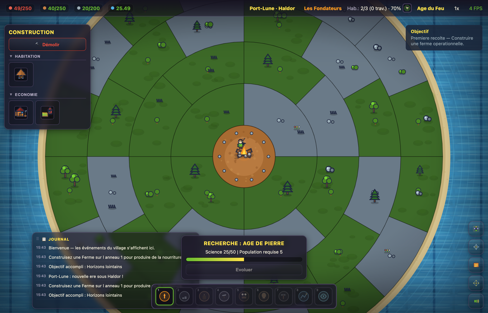
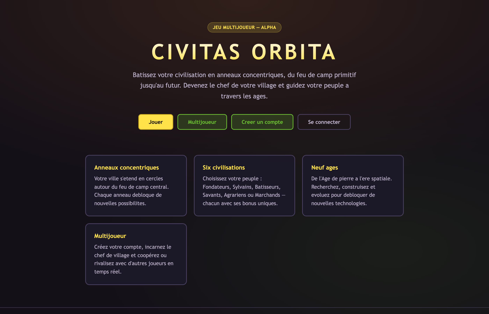
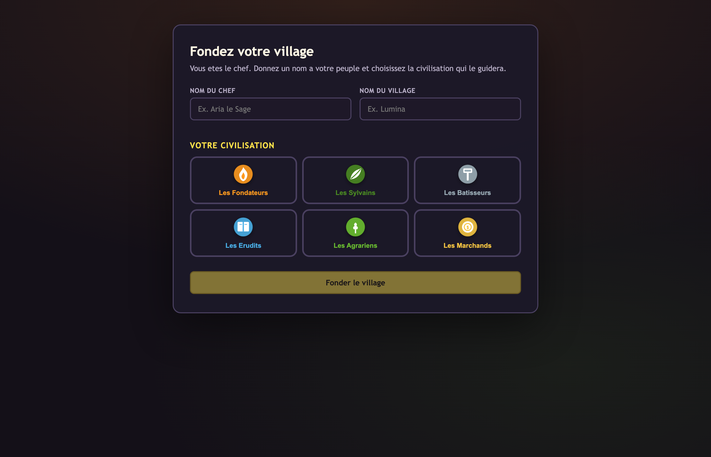

# Civitas Orbita

A colony-building game that spans the ages. Your city grows in **concentric rings** around a central campfire, from the Age of Fire to the Future. Rendering is **100% procedural** — no image or sound files are downloaded — in a pixel-art style inspired by the Game Boy Advance Pokémon games.

Player accounts (sign-up, login, character creation) are handled by a small Express API; single-player saves are stored in the cloud with a `localStorage` fallback, and an alpha multiplayer mode shares worlds over WebSocket.

> The game UI is in French.

## Screenshots

*Screenshots use the demo account and village seeded by the development server.*



| Landing page | Character creation |
| --- | --- |
|  |  |

## Features

### Site and accounts

- Public landing page (`/`)
- Sign-up / login (`/register`, `/login`) with JWT authentication
- Character creation (`/character`): chief name, village name and one of **6 civilizations** (passive bonuses + a rechargeable active ability)
- Game (`/play`) after login; multiplayer lobby (`/lobby`)

### Gameplay

- **Concentric ring map** (1, 4, 8, 12, 16… sectors) growing organically outwards, fully configurable
- **Terrain preparation**: clear or level a sector before building
- **Economy** with 8 resources: harvesting, production, consumption, storage
- **Production synergies** between adjacent buildings of the same group
- **Building upgrades** with growing costs and effects
- **Population**: housing, jobs, growth, famine, and manual workforce allocation (production, trade, research, military)
- **9 historical ages** unlocked through research, a ~27-node **technology tree**, 19 procedurally drawn buildings
- **Sea and exploration**: fog of war, scout boats, fishing boats, NPC islands and raids
- Animated rendering (living campfire, smoke, procedural sea), synthesised sound effects (Web Audio API), resizable event log

## Tech stack

| Layer | Technologies |
|---|---|
| Client | TypeScript (strict), PixiJS v8 (WebGL/WebGPU), Vite |
| Audio | Web Audio API — synthesised sound effects |
| API | Express, SQLite (`better-sqlite3`), JWT, bcrypt, WebSocket |
| Tests | Vitest (pure logic) |
| Deployment | Docker (Nginx + API), `/api` proxied in dev and prod |

## Getting started

```bash
npm install
npm run dev:all          # client on http://localhost:5173 + API on http://localhost:3001
```

On first start the API seeds a few demo accounts (see `server/src/seed.ts`) so you can log in right away.

```bash
npm run dev              # client only (proxies /api to localhost:3001)
npm run dev:server       # API only
npm run build            # type-check + Vite build
npm run build:server     # compile the API
npm run test             # unit tests
```

### API environment variables

| Variable | Default | Description |
|---|---|---|
| `PORT` | `3001` | API port |
| `JWT_SECRET` | — | Token signing secret (required in production) |
| `DATABASE_PATH` | `./data/civitas.db` | SQLite file |
| `CORS_ORIGIN` | `http://localhost:5173` | Allowed CORS origin |

### Docker

```bash
docker compose up --build              # production (Nginx + API) -> http://localhost:8080
docker compose --profile dev up dev    # development (HMR) -> http://localhost:5173
```

## Controls

| Action | Input |
|---|---|
| Select a sector / place a building | Left click |
| Move the camera | Drag, arrow keys or ZQSD |
| Zoom | Mouse wheel or `+` / `-` |
| Leave build mode | Right click / `Esc` |
| Recentre on the campfire | `C` |
| Pause | `Space` |
| Queue a building | `Shift` + click on a building card |

## Architecture

Strict separation between **simulation and rendering**: `GameState` is plain, serialisable data; the simulation runs at a fixed step and the renderer observes it at 60 FPS without mutating it. Content is **data-driven** — adding a resource, building, age, technology or civilization only means editing files in `src/config/`.

```
src/
  config/      data (ages, resources, buildings, technologies, civilizations…)
  core/        engine (EventBus, GameLoop, TimeManager, SaveSystem)
  world/       geometry (rings, sectors, sea, islands, boats)
  economy/     resources, production, synergies, fishing
  population/  inhabitants, jobs, workforce allocation
  research/    ages and technology tree
  buildings/   definitions, construction, upgrades
  rendering/   camera, procedural sprites, world renderer (PixiJS)
  audio/       synthesised sound effects
  game/        GameState, orchestrator, events
  ui/          HUD, panels, event log
  api/         HTTP client
  web/         site pages and router
server/src/    Express API (auth, characters, saves, worlds, WebSocket)
```

See `DEVBOOK.md` (French) for the detailed developer guide.
